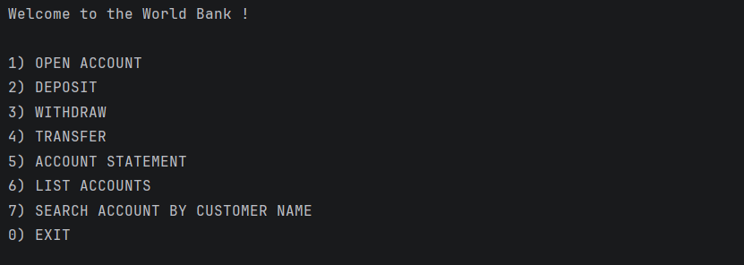
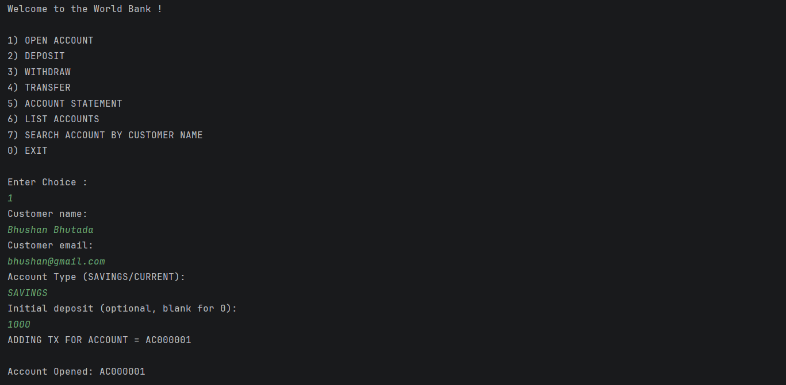
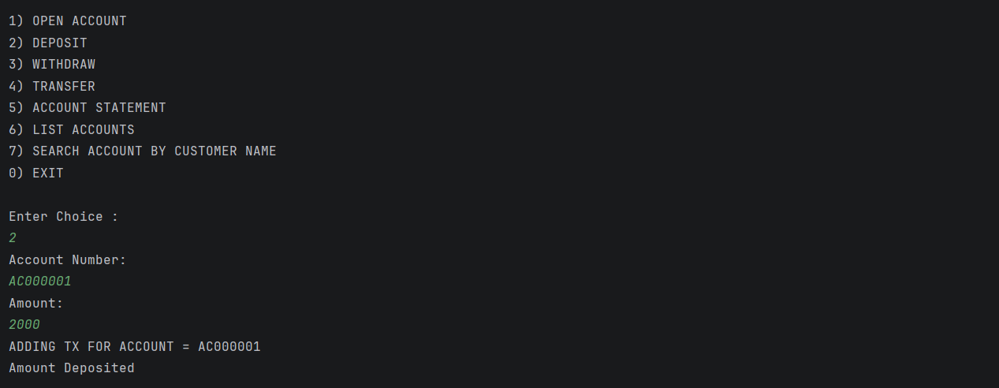
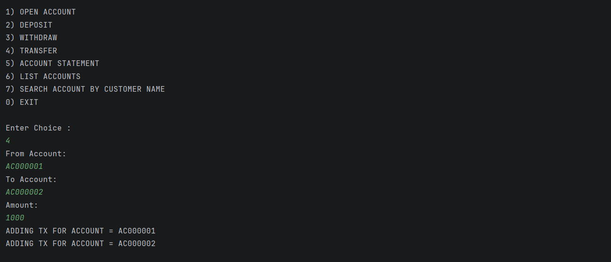
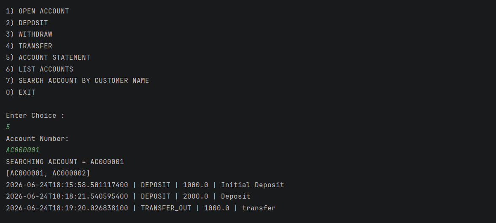
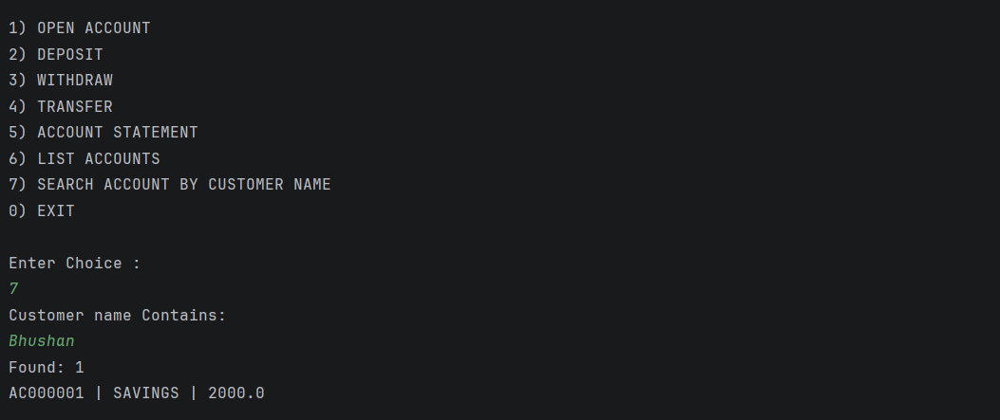
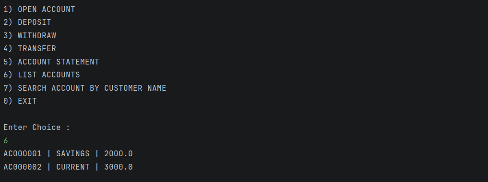

# BankFlow

A console-based banking application developed using Core Java following Layered Architecture principles. The project demonstrates Object-Oriented Programming (OOP), Repository Pattern, Service Layer abstraction, custom exception handling, transaction management, and in-memory data persistence using Java Collections Framework.

The application enables users to manage bank accounts, perform transactions, track account activity, and generate account statements through an interactive Command Line Interface (CLI).

---

## Features

* Open New Bank Account
* Deposit Money
* Withdraw Money
* Transfer Funds Between Accounts
* Generate Account Statements
* Search Accounts By Customer Name
* List All Accounts
* Transaction History Tracking
* Custom Exception Handling
* Layered Architecture Implementation

---

## Architecture

The application follows a layered architecture to ensure separation of concerns and maintainable code organization.

```text
Presentation Layer (CLI)
           │
           ▼
      Service Layer
           │
           ▼
    Repository Layer
           │
           ▼
 In-Memory Data Storage
      (HashMap)
```

### Layer Responsibilities

#### Domain Layer

Business entities representing core banking concepts.

* Account
* Customer
* Transaction
* TransactionType

#### Repository Layer

Responsible for data storage and retrieval operations.

* AccountRepo
* CustomerRepo
* TransactionRepo

#### Service Layer

Contains business rules and transaction processing logic.

* Account Creation
* Deposit
* Withdraw
* Fund Transfer
* Statement Generation
* Customer Search

#### Exception Layer

Handles business-specific validation failures.

* AccountNotFoundException
* InsufficientBalanceException
* SameAccountTransferException

---

## Project Structure

```text
Bank-App
│
├── src
│   ├── app
│   │   └── Main.java
│   │
│   ├── domain
│   │   ├── Account.java
│   │   ├── Customer.java
│   │   ├── Transaction.java
│   │   └── TransactionType.java
│   │
│   ├── exceptions
│   │   ├── AccountNotFoundException.java
│   │   ├── InsufficientBalanceException.java
│   │   └── SameAccountTransferException.java
│   │
│   ├── repository
│   │   ├── AccountRepo.java
│   │   ├── CustomerRepo.java
│   │   └── TransactionRepo.java
│   │
│   └── service
│       ├── BankService.java
│       └── impl
│           └── BankServiceImpl.java
│
├── screenshots
│
└── README.md
```

---

## Application Screenshots

### Main Menu



### Open Account



### Deposit Money



### Fund Transfer



### Account Statement



### Search Account



### List All Accounts



---

## Banking Operations

### Open Account

* Creates a customer profile
* Generates a unique account number
* Supports Savings and Current accounts
* Allows optional initial deposit

### Deposit

* Validates account existence
* Updates account balance
* Records transaction history

### Withdraw

* Validates account existence
* Checks available balance
* Updates account balance
* Records withdrawal transaction

### Transfer

* Prevents self-transfer
* Validates both accounts
* Verifies sufficient balance
* Creates debit and credit transaction records

### Statement Generation

* Retrieves account transaction history
* Sorts transactions by timestamp
* Displays transaction details in chronological order

### Customer Search

* Searches customers using name matching
* Retrieves linked accounts

---

## Design Patterns Used

### Repository Pattern

Encapsulates data access operations and isolates storage logic.

### Service Layer Pattern

Separates business logic from presentation and storage layers.

### Layered Architecture

Organizes application responsibilities into independent layers.

### Exception-Driven Validation

Uses custom exceptions to handle business rule violations.

---

## Technologies Used

* Java
* Object-Oriented Programming (OOP)
* Java Collections Framework
* Exception Handling
* IntelliJ IDEA
* UUID
* Layered Architecture

---

## Concepts Demonstrated

### Core Java

* Classes and Objects
* Encapsulation
* Abstraction
* Interfaces
* Enums
* Collections Framework
* Exception Handling

### Software Design

* Layered Architecture
* Repository Pattern
* Service Layer Pattern
* Separation of Concerns
* Modular Design

### Banking Workflows

* Account Lifecycle Management
* Transaction Processing
* Fund Transfer Logic
* Statement Generation
* Customer Search

---

## How To Run

### Clone Repository

```bash
git clone https://github.com/bhushanbhutada03/Bank-App.git
```

### Open Project

Import the project into IntelliJ IDEA.

### Run Application

Execute:

```text
src/app/Main.java
```

---

## Available Operations

```text
1. Open Account
2. Deposit
3. Withdraw
4. Transfer
5. Account Statement
6. List Accounts
7. Search Account By Customer Name
0. Exit
```

---

## Future Enhancements

* MySQL Integration
* JDBC Implementation
* Spring Boot REST API
* JPA/Hibernate Support
* Authentication & Authorization
* Transaction Persistence
* Unit Testing with JUnit
* Docker Support
* Logging Framework Integration

---

## Author

**Bhushan Bhutada**

Computer Engineering Student

LinkedIn:
https://www.linkedin.com/in/bhushan-bhutada-37b914295
